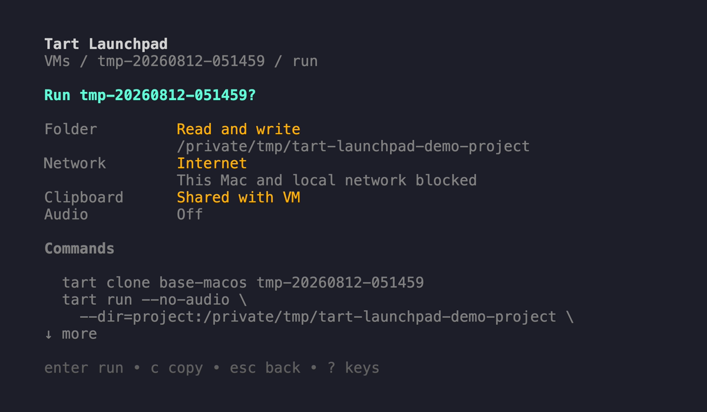

# Tart Launchpad

Choose what a Tart VM can touch before you run it.

Tart Launchpad is a terminal interface for local Tart VMs. It asks about project-folder access, clipboard sharing, guest audio, and network access. Before it changes or runs a VM, it shows the exact Tart command.



[Watch a short demo](docs/demo/tart-launchpad.gif)

## Requirements

- macOS with [Tart](https://tart.run/) installed and available in `PATH`.
- Go 1.22 or newer to build from source.
- Tart Softnet only when you choose `offline`, `internet`, `lan`, or `lan-and-internet` network access.

## Build and run

```sh
go build -o tart-launchpad ./cmd/tart-launchpad
./tart-launchpad
```

## Use it

1. Select a VM. Launchpad treats ordinary VMs as workspaces by default. Mark a clean source VM as a template when you want to create new VMs from it.
2. Choose host connections and network access.
3. Review the generated commands, then run them.

Templates can create a workspace or a temporary VM, or run with a read-only root disk. Launchpad generates names for temporary VMs and removes them after the run.

## Plan without running

Use `plan` when you only want to see the commands:

```sh
./tart-launchpad plan \
  --vm example-vm \
  --folder-access read-folder \
  --project-folder "$PWD" \
  --network-access offline
```

The command prints the Tart commands and does not execute them.

## Host connections

The project folder initially uses the directory where you start Launchpad. Choose **Project folder** on the Connections screen to use another folder.

- `no-folder`: share no host folder.
- `read-folder`: share the selected project folder read-only.
- `edit-folder`: share the selected project folder read-write.

Clipboard and guest audio are independent per-run choices. Both start off. Clipboard sharing is bidirectional; guest audio plays through the host and does not grant microphone access.

Network access:

- `offline`: block outbound IPv4 through Softnet.
- `internet`: allow internet access through Softnet; block the host and local private networks.
- `host`: use Tart's host-only network.
- `lan`: allow configured local network ranges only.
- `lan-and-internet`: allow configured local network ranges and the internet.

`offline` blocks outbound IPv4; it is not a guarantee of complete network isolation.

Launchpad is not a security sandbox. It makes each run's selected host connections visible before execution.

## Interface design

The product-wide palette, hierarchy, screen patterns, copy rules, responsive behavior, and keyboard model are documented in [DESIGN.md](DESIGN.md).
